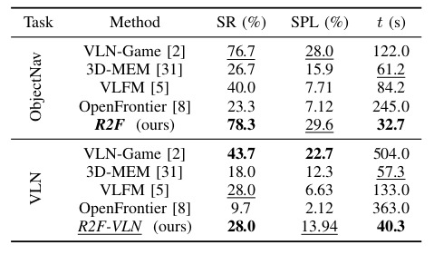
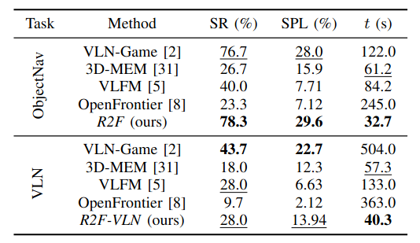

# R2F: Repurposing Ray Frontiers for LLM-free Object Navigation

Official anonymized repository for IROS submission

## To the kind attention of the reviewers

We acknowledge that the submitted version of the paper contains a few formatting errors in the results tables. In particular, two typos are present:

- in the ObjectNav section, the SPL value for R2F should be bold rather than underlined, as our method achieves the best result on that task.

- in the VLN task, our SR value was mistakenly highlighted in bold, whereas it should have been underlined, since it corresponds to the second-best result after VLN-Game.

These mistakes, especially the second one, were entirely unintentional. Notably, despite the formatting error, the discussion in Section IV-D (Results) correctly describes our method as the second-best performer in the VLN task. In that section, we explicitly state that our approach ranks behind VLN-Game.

<p align="center">
  
  
</p>

## Setup

```bash
conda create -n r2f python=3.9 cmake=3.22 -y && conda activate r2f 
conda install habitat-sim=0.3.0 -c conda-forge -c aihabitathabitat 
pip install -r requirements.txt
python -m spacy download en_core_web_sm   # required for --vln
```

Model weights for `radio_v2.5-b` and `siglip` are downloaded automatically to `ckpt/` on first run. `HF_HOME` is set to `ckpt/` automatically via Hydra — to relocate the cache, change `hydra.job.env_set.HF_HOME` in [config/config.yaml](config/config.yaml).

## Data

The evaluation tasks can be found under `data/hm3d/val/`.
Follow the instruction from the official [Habitat-Matterport3D](https://aihabitat.org/datasets/hm3d-semantics/) repository to download the following scenes: `813, 824, 827, 829, 848, 853, 871, 876, 880, 894`.
Organize the downloaded data as follows:

```
data/hm3d/val/
  tasks-objnav.csv     # object-nav tasks
  tasks-vln.csv        # VLN tasks with instruction text
  <scene_hash>/
    <scene>.basis.glb  # 3D scene
    <scene>.navmesh    # for the path planner
    <scene>.json.gz    # for annotated gt
```

## Running a single task

```bash
# Object-nav, task 5, with viewer
python run_tasks.py episodes=5

# Headless
python run_tasks.py episodes=5 no_viewer=true

# VLN mode (NLP instruction parsing is automatic)
python run_tasks.py episodes=5 vln=true no_viewer=true

# Save RGB + similarity heatmap frames
python run_tasks.py episodes=5 dump=true no_viewer=true
```

## Batch run

```bash
# All 60 obj-nav tasks, headless
python run_tasks.py episodes=all no_viewer=true

# Subset by range or list
python run_tasks.py episodes=0-9 no_viewer=true
python run_tasks.py 'episodes=0,5,18' no_viewer=true

# Resume an interrupted run
python run_tasks.py episodes=all no_viewer=true resume=true
```


## Key flags
List of all the flags:

Config is in [conf/config.yaml](conf/config.yaml) and can be overridden from the CLI with `key=value` syntax.

| Key | Default | Description |
|---|---|---|
| `episodes` | required | `all`, `0-9`, or `0,5,18` |
| `max_steps` | 1000 | Step budget per episode |
| `map_every` | 5 | Frontier map update interval |
| `no_viewer` | false | Headless mode |
| `vln` | false | Read `tasks-vln.csv`, use instruction text as query (NLP parsing automatic) |
| `dump` | false | Save RGB + similarity heatmap every 5 steps |
| `resume` | false | Skip tasks already in `results.csv` |
| `seed` | 42 | Random seed |


Results are written incrementally to `results/<timestamp>/results.csv`.

## Evaluation

```bash
python eval.py                                  # latest results run
python eval.py csv_path=results/<timestamp>/    # specific run
python eval.py json=true                        # machine-readable output
```

Metrics reported:

| Metric | Description |
|---|---|
| `success_rate` | Fraction of episodes where agent ended within 1.5m of the target |
| `spl` | Success weighted by path length (Anderson et al., 2018) |
| `avg_elapsed_s_on_success` | Mean wall-clock time on successful episodes |
